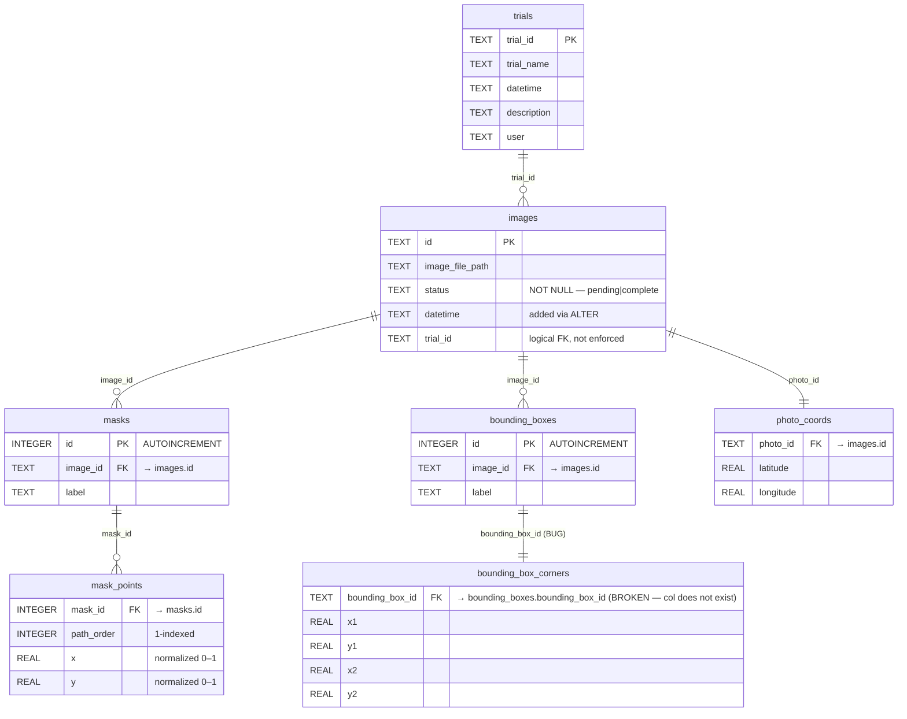
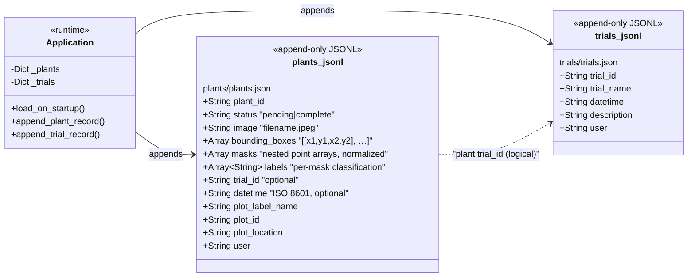
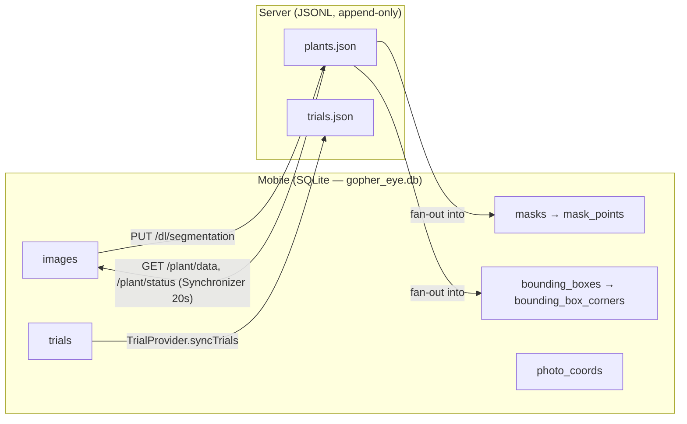

# Gopher Eye — Mobile App Architecture (UML)

UML class diagram of the Flutter app's runtime structure: state-management
roots (GetX + Provider), services, controllers, providers, models, and the
screens/widgets that consume them.

```mermaid
classDiagram
    direction LR

    %% =========================================================
    %% Boot / DI roots
    %% =========================================================
    class Main {
        +main()
        -bootFirebase()
        -bootServerConfig()
        -bootDatabase()
        -registerGetX()
        -wrapMultiProvider()
    }

    class GetXRegistry {
        <<service locator>>
        +put(ApiServiceController, permanent)
        +put(LocationController, permanent)
    }

    class MultiProvider {
        <<provider root>>
        +TrialProvider
        +ModelProvider
        +LocationProvider
    }

    Main --> GetXRegistry : registers
    Main --> MultiProvider : wraps app
    Main --> Synchronizer : starts (20s)
    Main --> AuthStorage : restores creds

    %% =========================================================
    %% Services (singletons / GetX controllers)
    %% =========================================================
    class ApiServiceController {
        <<GetX>>
        +RxBool isLoading
        +sendImage(File, Map) String
        +getPlantData(id) ImageData
        +getPlantImage(id, name) Uint8List
        +getPlantStatus(id) String
        +getPlantIds() List~String~
    }

    class AppDatabase {
        <<sqflite>>
        +initDatabase()
        +insertImage(ImageData)
        +getImage(id) ImageData
        +getAllImages() List~ImageData~
        +getMasks(imageId)
        +getBoundingBoxes(imageId)
        +insertTrial(Trial)
        +getAllTrials() List~Trial~
    }

    class Synchronizer {
        +Timer timer
        +syncData()
        +stop()
        -_syncPlant(plantId)
    }

    class LocalSegmentationService {
        <<singleton, ONNX>>
        +ensureLoaded()
        +encodeImage(File)
        +predictMaskAtPoint(x, y) Uint8List
        +maskToImage(mask, w, h) Image
        +clearEmbedding()
        +dispose()
    }

    class ServerConfig {
        +String defaultUrl
        +Duration httpTimeout
        +get url() String
        +set(String)
        +ensureInitialized()
    }

    class AuthStorage {
        <<flutter_secure_storage>>
        +getPassword() String?
        +setPassword(String)
        +clear()
    }

    class OfflineMode {
        +bool isEnabled
        +set(bool)
        +saveImageLocally(File, Map) String
        +clear()
    }

    class LocationController {
        <<GetX>>
        +Rxn~XFile~ latestPhoto
        +Rxn~LatLng~ latestCoords
        +updateLatestLocation(lat, lng, XFile)
    }

    class PhotoHandler {
        +getCoordsFromPhoto(XFile) String
    }

    %% Service-to-service deps
    ApiServiceController --> ServerConfig
    Synchronizer --> ApiServiceController
    Synchronizer --> AppDatabase
    Synchronizer --> OfflineMode
    OfflineMode --> AppDatabase
    LocationController --> AppDatabase

    %% =========================================================
    %% Native controller
    %% =========================================================
    class IOSCameraController {
        <<extends CameraController>>
        +setManualFocus(Offset)
        +setLensPosition(double)
        +getLensPosition() double
        +generateFocusStack(List~String~) String?
    }

    %% =========================================================
    %% Providers (ChangeNotifier)
    %% =========================================================
    class TrialProvider {
        <<ChangeNotifier>>
        -Trial? _currentTrial
        -List~Trial~ _trials
        -Timer? _syncTimer
        +setCurrentTrial(Trial?)
        +loadLocalTrials()
        +createTrial(Trial)
        +startSync()
        +stopSync()
        +syncTrials()
    }

    class ModelProvider {
        <<ChangeNotifier>>
        -String _currentModel
        +getCurrentModel() String
        +setModel(String)
    }

    class LocationProvider {
        <<ChangeNotifier>>
        -String _location
        -String _id
        -String _label
        +setLocation(String)
        +setId(String)
        +setLabel(String)
        +setJson(Map)
    }

    TrialProvider --> AppDatabase
    TrialProvider --> ServerConfig

    %% =========================================================
    %% Models
    %% =========================================================
    class ImageData {
        +String? id
        +String? image
        +List~List~double~~? masks
        +List~List~double~~? boundingBoxes
        +List~String~? labels
        +String status
        +DateTime? dateTime
        +String? trialId
        +fromJson(Map) ImageData
        +toJson() Map
    }

    class Trial {
        +String trialId
        +String trialName
        +String datetime
        +String description
        +String user
        +fromJson(Map) Trial
        +toJson() Map
    }

    class UserModel {
        +String name
        +String email
        +String password
    }

    AppDatabase ..> ImageData : serializes
    AppDatabase ..> Trial : serializes
    ApiServiceController ..> ImageData : returns

    %% =========================================================
    %% Screens
    %% =========================================================
    class HomeScreen
    class LoginScreen
    class SignupScreen
    class WelcomeScreen
    class CameraScreen
    class PreviewScreen
    class LocalSegmentationScreen
    class PlantInfoScreen
    class PlantUploadScreen
    class PlantCaptureScreen
    class CreateTrialScreen
    class QrCodeGeneratorScreen
    class ResultScreen
    class MapScreen

    HomeScreen --> ApiServiceController
    HomeScreen --> TrialProvider
    HomeScreen --> AuthStorage

    LoginScreen --> AuthStorage

    CameraScreen --> IOSCameraController
    CameraScreen --> ModelProvider
    CameraScreen --> LocationProvider
    CameraScreen --> TrialProvider

    PreviewScreen --> ApiServiceController
    PreviewScreen --> LocationController
    PreviewScreen --> PhotoHandler
    PreviewScreen --> OfflineMode
    PreviewScreen --> TrialProvider
    PreviewScreen --> LocationProvider

    LocalSegmentationScreen --> LocalSegmentationService

    PlantInfoScreen --> ApiServiceController
    PlantInfoScreen --> AppDatabase
    PlantInfoScreen --> TrialProvider

    PlantUploadScreen --> ApiServiceController
    PlantCaptureScreen --> ApiServiceController
    CreateTrialScreen --> TrialProvider
    MapScreen --> LocationProvider

    %% =========================================================
    %% Widgets (leaf UI, no logic shown)
    %% =========================================================
    class CameraCaptureCard
    class CameraControlButton
    class MobileScannerWithOverlay
    class PreviewList
    class PreviewTile
    class BottomNavigatorBar

    PreviewList ..> ImageData : renders
    PreviewTile ..> ImageData : renders
```

## Notes on the diagram

- **Two state-management roots coexist**: GetX hosts `ApiServiceController`
  and `LocationController` (registered `permanent: true`); `MultiProvider`
  hosts the three `ChangeNotifier` providers. New code should pick whichever
  root the surrounding code already uses.
- **`ServerConfig` is the only sanctioned source of the backend URL** —
  every network-touching class (`ApiServiceController`, `TrialProvider`,
  `Synchronizer`) resolves it through `ServerConfig.url`.
- **`Synchronizer` is a background-only actor** — it owns a `Timer` started
  from `main.dart`, polls `ApiServiceController`, and writes into
  `AppDatabase`. No screen talks to it directly.
- **Models are plain DTOs** — `ImageData` and `Trial` carry data between
  `AppDatabase` (sqflite rows) and `ApiServiceController` (JSON over HTTP).

---

# Gopher Eye — Database Architecture (ER / UML)

Two persistence layers: the mobile app's local **SQLite** database
(`gopher_eye.db`, schema v1, defined in `lib/services/app_database.dart`)
and the server's append-only **JSONL** stores (`plants.json`,
`trials.json`, defined in `server/app/application.py`).

## Mobile SQLite schema

### Schema notes / known issues

| # | Issue | Where |
|---|-------|-------|
| 1 | FK `bounding_box_corners.bounding_box_id → bounding_boxes(bounding_box_id)` references a column that does not exist on the parent (which uses `id INTEGER`). FK is silently ignored unless `PRAGMA foreign_keys=ON` is set, and even then the constraint is invalid. | `app_database.dart` |
| 2 | `images.trial_id` is a logical foreign key with no `FOREIGN KEY` clause — orphans are possible if a trial is deleted. | `app_database.dart` |
| 3 | `mask_points` and `bounding_box_corners` have **no primary key** and **no unique constraint** — duplicate point rows are possible; row identity must be enforced at the application layer. | `app_database.dart` |
| 4 | No `ON DELETE CASCADE` anywhere — deleting a parent row leaves orphaned masks / boxes / coords. | `app_database.dart` |
| 5 | `images.datetime` and `images.trial_id` are added via "soft" `ALTER TABLE` calls (try/catch on insert) instead of an `onUpgrade` migration; schema version stays at 1. | `app_database.dart` |
| 6 | `photo_coords` enforces 1:1 with `images` via REPLACE conflict resolution at the application layer rather than a primary key. | `app_database.dart` |

## Server JSONL stores

The Flask server persists append-only JSONL records. The in-memory dicts
(`Application._plants`, `Application._trials`) are the runtime source of
truth and are rehydrated from these files on startup.

### Sync relationship between the two layers

- The mobile DB is the **source of truth for local state**; server JSONL
  files are an **append-only archive** with no row-level update or delete.
- `Synchronizer` polls every 20 s and re-flattens server-side
  `bounding_boxes` / `masks` / `labels` arrays back into the mobile
  `masks`, `mask_points`, `bounding_boxes`, `bounding_box_corners` tables.
- There is no transactional consistency between the two layers — the
  contract is "eventual via polling".
